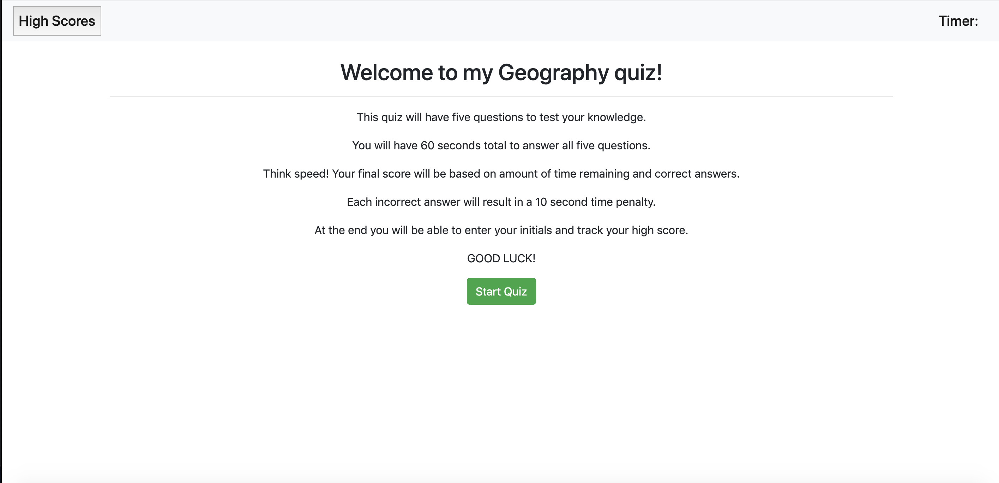

# Code-Quiz
DESCRIPTION:
This is a quiz created with JavaScript to test general knowledge of geography.

The quiz consists of five questions and is timed at 60 seconds. The quicker the user answer questions correctly the higher the score, as it is directly correlated to time remaining. 

Additionally, each wrong answer results in a 10 second penalty.

Once the user either completes the quiz or runs out of time they are able to enter their initials to log their score [was not able to get this functionality to work properly].

The user can then restart the quiz to try and beat their score!

FUNCTIONALITY:
This quiz was created using HTML. It utilizes Bootstrap components and some minor manual CSS styling.

The quiz utilizes JavaScript/jQuery to add dynamic functionality, such as timing the user, logging answers and score, cycling through questions, etc.

IMAGE:

LINK:
https://danfenichel.github.io/Code-Quiz/
